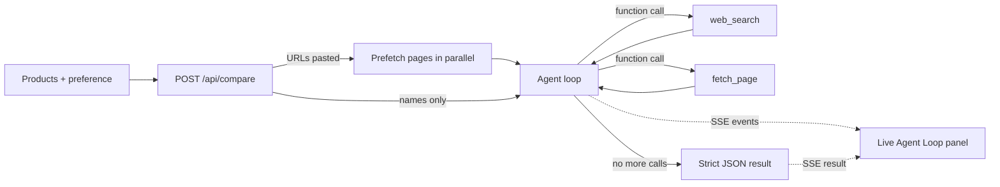

<h1 align="center">Shopping Compare Agent</h1>

<p align="center">
  A tool-using AI agent that researches products on the live web and returns a <b>sourced decision table</b>.
</p>

<p align="center">
  
  
  
  
</p>

---

## Overview

Give it 2–4 products and what you care about. The agent plans its own comparison criteria, searches the public web, reads the pages it finds, and answers with a table where **every cell links to its source** — plus a single recommendation tied to your stated preference.

It is an agent, not a prompt wrapper: the model decides which tools to call and when to stop, and the UI streams that loop as it happens.

```
Products + preference  →  plan criteria  →  search / fetch  →  observe  →  decide
                              ↑______________________________________|
                                        (up to 5 rounds)
```

## Features

- **Real tool use** — Gemini function calling over `web_search` and `fetch_page`, multiple calls per turn, executed in parallel
- **Transparent loop** — every status change and tool call is streamed to the UI over Server-Sent Events
- **Cited results** — each table cell carries a source URL; unverifiable facts must come back as `unknown`
- **Paste names or links** — Amazon and official product URLs are canonicalized and prefetched before the model runs
- **Per-criterion winners** — a "who wins" matrix on top of the detail table, plus one overall pick
- **Bilingual** — EN / 中文 UI, with the locale passed to the model so column names and reasoning match
- **Free-tier friendly** — capped rounds, parallel calls, and 429 backoff that reads Gemini's own retry hint

## Architecture



| Stage | Responsibility | File |
| --- | --- | --- |
| Parse | Name vs URL detection, Amazon `/dp/<ASIN>` canonicalization | `lib/productInput.ts` |
| Prefetch | Fetch pasted pages in parallel before inference | `lib/agent.ts` |
| Loop | Prompt, tool schema, round cap, quota retries | `lib/agent.ts` |
| Tools | DuckDuckGo HTML search, page fetch via r.jina.ai with direct fallback | `lib/tools.ts` |
| Transport | Request validation and SSE stream | `app/api/compare/route.ts` |
| Client | SSE parsing and agent state | `hooks/useCompareRun.ts` |

## Agent design

**Tools exposed to the model**

| Tool | Args | Returns |
| --- | --- | --- |
| `web_search` | `query: string` | Top 5 results as title / URL / snippet |
| `fetch_page` | `url: string` | Cleaned page text, capped at 8k chars |

**Output contract** — the run ends when the model stops calling tools and emits JSON only:

```json
{
  "products": ["A", "B"],
  "columns": ["Price", "Weight"],
  "cells": { "A": { "Price": { "text": "$348", "source": "https://..." } } },
  "wins": { "Price": "A", "Weight": "B" },
  "pick": { "name": "A", "reason": "one short sentence tied to the user's preference" }
}
```

**Guardrails**

- A source URL is required per cell; missing facts must be `unknown` rather than invented
- Product names in the output must be real names, never the pasted URL
- Round cap of 5 and a tool-result budget keep a demo run bounded
- `429` responses parse Gemini's `retry in Ns` hint and surface a localized pause instead of failing
- The API key stays server-side; the browser only ever receives SSE events

## Getting started

**Prerequisites** — Node 18+ and a [Gemini API key](https://aistudio.google.com/apikey) (the free tier is enough).

```bash
git clone https://github.com/tianyaliu95/shopping-compare-agent.git
cd shopping-compare-agent
cp .env.example .env      # add GEMINI_API_KEY
npm install
npm run dev
```

Open http://localhost:3000 and click a category chip for a pre-filled example.

| Variable | Required | Default | Notes |
| --- | --- | --- | --- |
| `GEMINI_API_KEY` | yes | — | Server-side only |
| `GEMINI_MODEL` | no | `gemini-3.5-flash-lite` | Chosen for free-tier rate limits |

## Project structure

```
app/
  api/compare/route.ts     validation + SSE stream
  layout.tsx  icon.svg     fonts, metadata, favicon
components/
  CompareApp.tsx           state + composition
  compare/                 Header, CompareForm, AgentLoop, ResultSection, …
hooks/
  useCompareRun.ts         SSE client + agent state
  useFollowScroll.ts       scroll choreography
lib/
  agent.ts                 prompt, tool schema, agent loop, retries
  tools.ts                 web_search + fetch_page
  productInput.ts          name vs URL parsing, Amazon canonicalization
  i18n.ts                  EN / 中文 copy and examples
```

## Roadmap

- [ ] Follow-up refinement ("ignore price, weight battery life higher")
- [ ] Shareable result URLs and export
- [ ] Recent comparisons kept locally
- [ ] Criterion weights in the input

---

Built by [Tianya Liu](https://www.tianyaliu.ca/).
